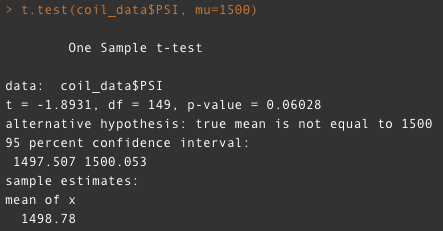
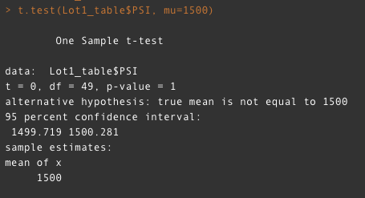
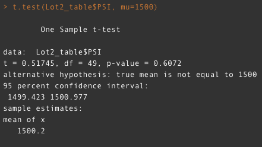
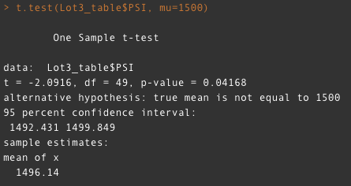

# MechaCar_Statistical_Analysis

## Linear Regression to Predict MPG

- Which variables/coefficients provided a non=ranfdom amount of variance to the mpg values?
ground clearance, vehcile weight, and vehicle length

Upon running a linear regression analysis on the the multiple factors that could effect mpg available to use, we were able to determine that only three variables actually had a non-random amount of variance, ground clearance, vehicle weight, and vehicle length.

- Is the slope of the linear model considered to be zero? Why or why not?
The slope of this linear model would be considered zero as the model is designed to determine if there is a positive correlation between the dependent variables and the independent variables. When the model predicts that the variance is not random, then the model indicates such through a near zero coefficient for the independent variables.

- Does this linear model predict mpg of the MechaCar prototypes effectively? Why or why not?
It does, the high r-squared value indicates that it is fairly reliable at predicting the protoypes mpg.

## Summary Statistics on Suspension Coils

- The design specifications for the MechaCar suspension coils dictate that the variance of the suspension coils must not exceed 100 pounds per square inch. Does the current manufacturing data meet this design specification for all manufacturing lots in total and each lot individually? Why or why not?

The current manufacturing data as a whole does meet the design specifications for the suspension coils as the variance for all lots together is > 100 PSI. However, when breaking down the data by lot, it is clear that Lot3 suffers from an unacceptable amount of variance according to the design specifications at 170.29 PSI which is greater than the 100 PSI allowed. By addressing the issues with Lot3, the total variance among the lots will also drop to more admirable levels.

## T-Tests on Suspension Coils

Based on the t-test performed on the manufacturing data, as a whole we can see that the p-value for all lots combined was greater than .05 and therefore we cannot reject the null hypothesis that there is a statistical difference between the sample data and the population mean.

When we break dow the data, however we can see that for one lot, Lot3, we would reject the null hypothesis and determine that there is a statistical diffference between the PSI data in Lot3 and the population mean.

- Lot1 Data

- Lot2 Data

- Lot3 Data

As shown above, the Lot1 and Lot2 t-tests provided p-values >.05 and therefore could not reject the null hypothesis. However, the Lot3 t-test did provide a p-value that was not >.05 and so the null hypothesis was rejected.

## Study Design: MechaCar vs Competition

In order for the MechaCar to be a success, it will have to outperform it's competitors. Given it's name, most consumers will likely expect the car to be a city car, so the primary focuses of consumers in that market will be on city fuel efficiency, safety, maintenance costs, and the most important factor for every consumer, price. Using these critera, we could create a multiple line regression analysis to determine the effects of these variables on customer demand for the vehicle. In this case, we would actually be looking to determine how each variable effects consumer demand, so the null hypothesis would be that each variable does not affect consumer demand. For this data we would need to conduct surveys of individuals to determine how much they value each individual feature, and then their overall willingness to purchase vehicles at different levels of each variable. We can then run a multiple line regression and determine if the individual ratings of important features, matches with the features of the cars ratings to determine if the random variance with each variable.